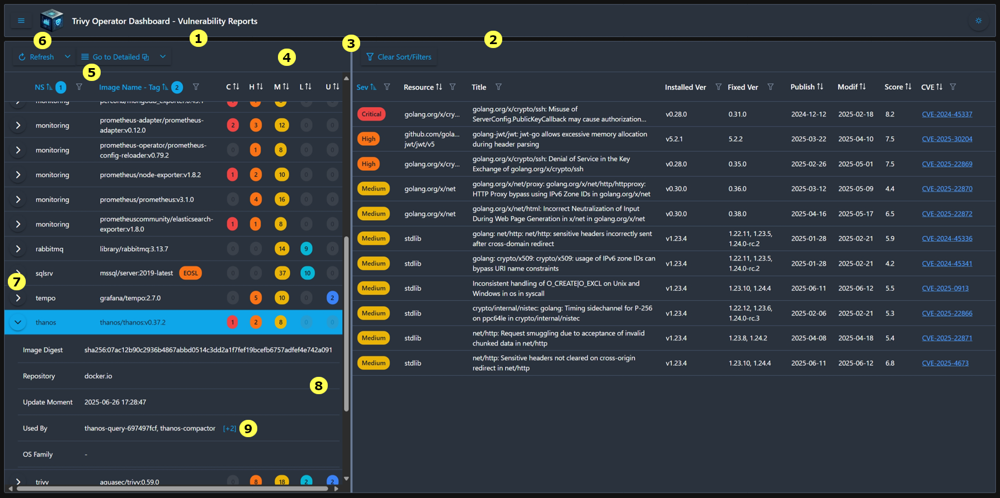
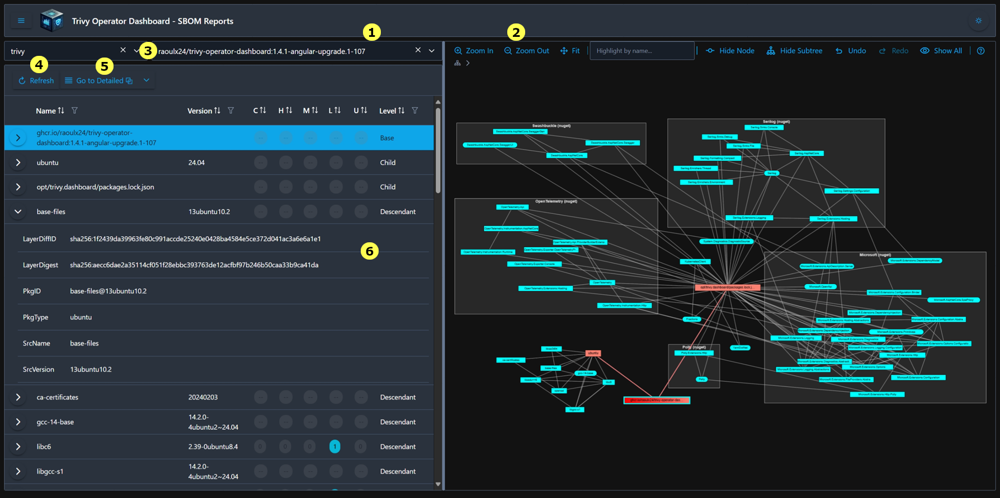

# Trivy Operator Dashboard Documentation

## Trivy Reports

All Trivy Reports can be seen in three ways: Overview mode (in Home), 
Inspect mode (Browse) and Detailed. Each is described in detail below.

> **Note:** All examples in this documentation are from Vulnerability Reports pages, as all Trivy Reports related pages are similar as layout and functionalities, with one big exception, SBOM Reports.

### Home - Overview mode

It is the "at a glance" page, where various statistics related to Trivy Reports can be seen.

On the left are some tables related to various statistics **(1)**, and on the right (where applicable) are some graphs **(2)** to give an idea how they stand.

 *Main Overview page*

Also, some other info can be seen here, by pressing the **More** buttons **(3)**.

 *More on Severities*

The **Refresh Data** button **(4)** reloads data from the backend.

The **Distinct values** **(5)** groups identical values in order to provide a clearer understanding of the reports; i.e. in Vulnerability Reports Statistics, severities are shown as distinct (unique) values, which means that if the same Vulnerability is found in many containers, it will be counted as one.

### Inspect mode (Browse)

This page groups reports to simplify inspection. The layout is a classic master **(1)** - details **(2)** one.

In the case of Vulnerability Reports, the master table **(1)** contains the images and the detail table **(2)** the related vulnerabilities. Identical images are grouped to avoid duplication, and their usage by Replicasets, Statefulsets, Jobs etc. can be seen by accessing **(6)**.

 *Inspect (browse) page*

In all tables you can find various action buttons **(3)**, most of the columns can be filtered and sorted **(4)**. Depending on the case, some tables support row expansion **(5)**, if more info can be displayed **(6)** (and *Image usage in namespace*)

 Between the two tables, there is a splitter, that allows fast changing of their ratio/size **(7)**.

 *Image usage in namespace*

If **(8)** is a Split Button, then the popup can be used to filter the data directly from the server. This can be useful, as an example, if you're a developer and want to view only severities that are Critical, High and Medium from a specific namespace.

Also, most of the **Inspect mode (Browse)** pages have a **Multi action** button **(9)**

 *Server-side filter*

### Detailed

In this mode, all data is denormalized in a single large table, with all info from Reports. Filtering, sorting and CSV export are available.

 *Details page*

## SBOM Reports

Unlike other reports, SBOM Reports are not well-suited for a simple master-detail view. Due to their structure, they are more effectively displayed as a table **(1)** and a graph **(2)**.

 *SBOM page*

The table includes **Image selection** **(3)**, **Refresh** button **(4)**, **Multi action** button **(5)** and the list of BomRefs - for any of them, properties can be visualized **(6)**.

 *Image Selection* - The shield icon next to the image name indicates that a Vulnerability Report is also available

**Multi action** button contains many useful actions. Specific to SBOM:
- **Info** will display an in-depth information page. See *Info page* below
- **Dive In** will change the current root element in table and in graph
- **Export to CycloneDX** (XML or JSON) and **Export to SPDX** (JSON)

SBOMs can be exported in CycloneDX format on both the Inspect/Browse and Detailed pages, while SPDX format is available only on the Inspect/Browse page and it is experimental.

### Info Page

It has 4 sections:
- SBOM and Vulnerabilities **(1)**
- Image usage info **(2)**
- License usage per component **(3)**
- A property pivot displayed as a tree structure, showing each Name, its corresponding Values, and the BomRefs associated with those values **(4)**

 *SBOM Info Page*

### Graph

It consists in 3 sections:
1. Toolbar. Here, various actions can be performed over the graph:
    - **Zoom In**, **Zoom Out** and **Fit** - These actions are self-explanatory
    - search for nodes by a string in their name
    - "edit" part of the graph. More info a bit down, in *Interaction with Graph* 
2. Navigation - Displayed when a **Dive In** action is performed on the graph. A **Dive in** action is drawing only the part of the graph that contains the descendants (direct or indirect) of the selected node that becomes the new root
3. The graph. A synthetic graph is as follows:

 *SBOM Graph*

#### Colors

- **Red** - Selected node and adjacent nodes (neighbors)
- **Blue** - Hovered node and adjacent nodes (neighbors)
- **Gray** - Group of nodes. It appears slightly transparent.
- **White** - Other nodes

#### Shapes

- **Rectangle** - Nodes with children
- **Rounded Rectangle** - Leaf nodes (nodes without children)
- **Container with nodes** - A container that groups nodes. Usually, it is based on something similar to namespaces or package repositories

#### Color Intensity

- **Darker (red or blue)** - Parent of selected/hovered nodes
- **Lighter (red or blue)** - Child of selected/hovered nodes
- **Gradient (red or blue)** - Selected/hovered nodes. These nodes are also emphasized using a strong contrasting border
- **Haloed (red or blue)** - Circular reference. Those nodes also depend on selected/hovered node
- **Dimmed** - Unhighlighted Nodes. Their names do not include the searched term

#### Interaction with Graph

- **Click** - Select a node. Any previously selected nodes will be deselected
- **Ctrl + Click** - Select additional nodes
- **Ctrl + Mouse Drag** - If dragging starts in empty space, all nodes within the selection range will be selected
- **Dbl Click** - Dive into the graph. The clicked node becomes the new root; only its descendants (of any kind) and direct parents will be displayed 
- **Hide Node** - The selected node will be hidden. If orphans remain (nodes with no parents or children), they will also be hidden
- **Hide Subtree** - The selected node and all its direct descendants will be hidden. If orphans remain (nodes with no parents or children), they will also be hidden

## Others

### Watcher States

The backend uses Kubernetes Watchers to get the changes in real-time. Their states (running, errors) can be seen here with remediation solutions.

 *Watcher States*

> **Note:** If any watcher is in an error state, an alert will be triggered, and a Notification Bell appears in the top menu bar.

### Settings

It consists in four main sections:
- Table States - all tables from the app persist their states (column order and size, sorts, filters etc.). Here you can clear the saved state as needed.
- CSV File Names - all file names used for exports to CSV are persisted. If you wish to change their defaults, here it is the place to do it
- Trivy Reports States - here sections related to a Trivy Report can be (in)activated in the frontend (i.e. there is no need to use Config Audit Reports). Also, if inactivated in the backend, it will also be reflected here.
- Display Settings - here you can choose how the severities count are displayed. You can also preview your selection

 *Settings Page*

### About

The page provides essential information about the app, including version details, release notes, and acknowledgments.

**Version Check** allows users to see their current version and whether an update is available.

**Release Notes** document recent updates, including improvements and bug fixes.

**Credits** lists the technologies and frameworks that support the app.

### Dark/Light Mode

The application fully supports Dark/Light mode. It can be switched on the fly at any desired moment and persists between sessions. By default, the application uses the mode provided by the browser/system.

 *Dark/Light Mode*