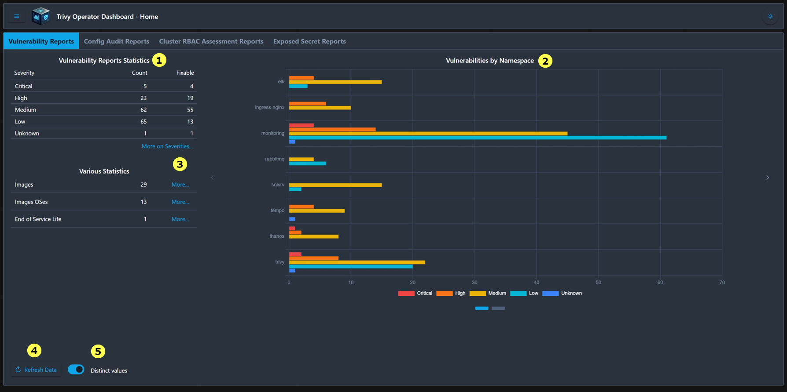
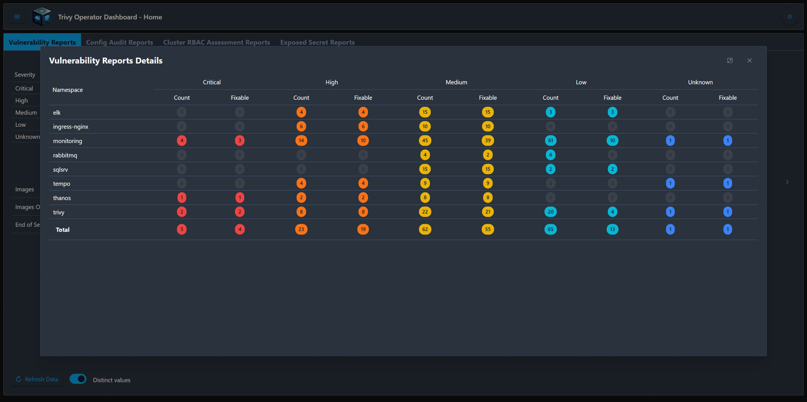
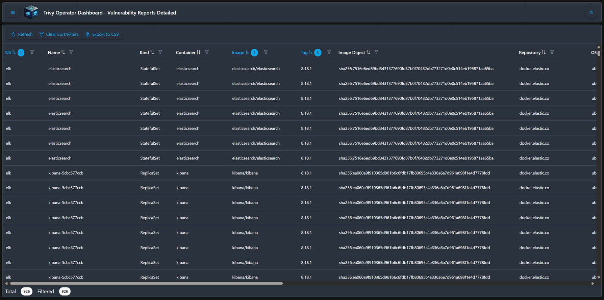
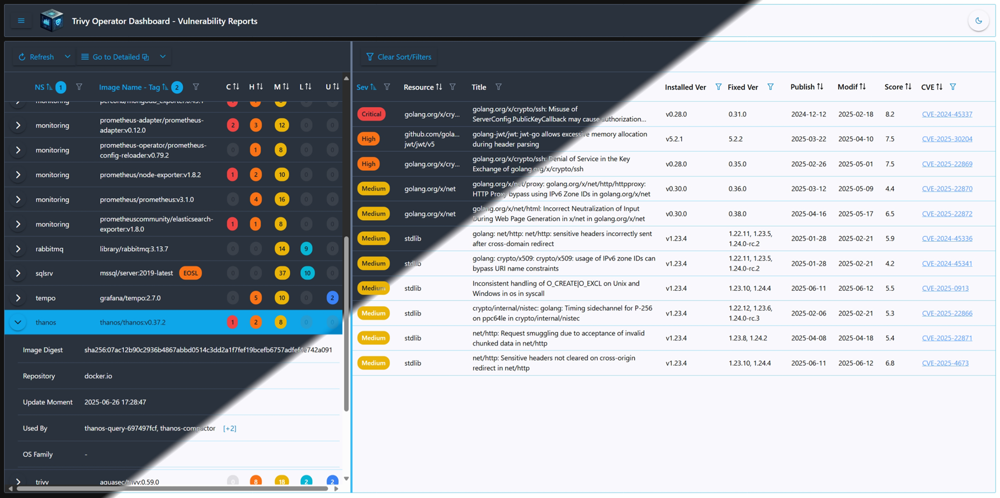

# Trivy Operator Documentation

## Trivy Reports

All Trivy Reports can be seen in three ways: Overview mode (in Home), 
Inspect mode (Browse) and Detailed. All of them are explained as follows.

> **Note:** All examples in this documentation are from Vulnerability Reports pages, as all Trivy Reports related pages are similar as layout and functionalities

### Overview mode

It is the "at a glance" page, where various statistics related to Trivy Reports can be seen.

On the left are some tables related to various statistics **(1)**, and on the right (where applicable) are some graphs **(2)** to give an idea how they stand.

 *Main Overview page*

Also, some other info can be seen here, by pressing the **More** buttons **(3)**.

 *More on Severities*

The **Distinct values** **(4)** is grouping same values in order to have a real feeling related to the reports; i.e. in Vulnerability Reports Statistics, the severities are shown as distinct (unique) ones, which means that if the same Vulnerability is found in many containers, it will be counted as one.

### Inspect mode (Browse)

It is the page where Reports are grouped in order to simplify their inspection. The layout is a classic master **(1)** - details **(2)** one.

In Vulnerability Reports case, the master table **(1)** contains the images and the detail table **(2)** the related vulnerabilities. To avoid duplicates, all images that are the same are grouped, and their usage by Replicasets, Statefulsets, Jobs etc. can be seen by accessing **(7)**.

 *Inspect (browse) page*

In all tables you can find various action buttons **(3)**, most of the columns can be filtered and sorted **(4)**. Depending on the case, some tables support row expansion **(5)**, if more info can be displayed **(6)**, **(7)**. And, of course, footer **(8)**

 *Image usage in namespace*

If **(9)** is a Split Button, then the popup can be used to filter the data directly from the server. This can be useful, as an example, if you are a dev and want to see only severities that are Critical, High and Medium from a specific namespace.

 *Server-side filter*

### Detailed

In this mode, all data is denormalized in a single large table, with all info from Reports. Filtering, sorting and CSV export are available.

 *Details page*

### SBOM Reports

SUnlike other reports, SBOM Reports are not well-suited for a simple master-detail view. Due to their structure, they are more effectively displayed as a table and a graph.

SBOMs can be exported in CycloneDX format on both the Inspect/Browse and Detailed pages, while SPDX format is available only on the Inspect/Browse page.

A synthetic graph is as follows:

 *SBOM Graph*

#### Colors

- **Red** - Selected node and adjacent nodes (neighbors)
- **Blue** - Hovered node and adjacent nodes (neighbors)
- **Dimmed** - Unhighlighted Nodes
- **Gray** - Group of nodes. It appears slightly transparent.
- **White** - Other nodes

#### Shapes

- **Rectangle** - Nodes with children
- **Rounded Rectangle** - Leaf nodes (nodes without children)
- **Container with nodes** - A container that groups nodes. Usually, it is based on something similar to namespaces or package repositories

#### Color Intensity

- **Darker (red or blue)** - Parent of selected/hovered nodes
- **Lighter (red or blue)** - Child of selected/hovered nodes
- **Gradient (red or blue)** - Selected/hovered nodes. These nodes are also emphasized using a strong contrasting border

#### Interaction with Graph

- **Click** - Select a node. Any previously selected nodes will be deselected
- **Ctrl + Click** - Select additional nodes
- **Ctrl + Mouse Drag** - If dragging starts in empty space, all nodes within the selection range will be selected
- **Dbl Click** - Dive into the graph. The clicked node becomes the new root, and only its descendants (of any kind) will be displayed
- **Hide Node** - The selected node will be hidden. If orphans remain (nodes with no parents or children), they will also be hidden
- **Hide Subtree** - The selected node and all its direct descendants will be hidden. If orphans remain (nodes with no parents or children), they will also be hidden

## Others

### Watcher States

The backend uses Kubernetes Watchers to get the changes in real-time. Their states (running, errors) can be seen here with remediation solutions.

 *Watcher States*

> **Note:** If any watcher is in an error state, an alert will be triggered, and a Notification Bell appears in the top menu bar.

### Settings

It consists in four main sections:
- Table States - all tables from the app persist their states (column order and size, sorts, filters etc.). Here you can clear the saved state as needed.
- CSV File Names - all file names used for exports to CSV are persisted. If you wish to change their defaults, here it is the place to do it
- Trivy Reports States - here sections related to a Trivy Report can be (in)activated in the frontend (i.e. there is no need to use Config Audit Reports). Also, if inactivated in the backend, it will be shown here.
- Display Settings - here you can choose how the severities count are displayed. There is also possibility to preview the choice.

 *Settings Page*

### About

The page provides essential information about the app, including version details, release notes, and acknowledgments.

**Version Check** allows users to see their current version and whether an update is available.

**Release Notes** document recent updates, including improvements and bug fixes.

**Powered By** lists the technologies and frameworks that support the app.

### Dark/Light Mode

The application fully supports Dark/Light mode. It can be switched on the fly at any desired moment and persists between sessions. By default, the application uses the mode provided by the browser/system.

 *Dark/Light Mode*

## Important note

Some sample images from this documentation are not reflecting the latest ones from the application. The differences a subtle, and not impacting the information depicted here. Some notable differences are the vulnerability count colors (zero/null ones are grayed) and in Inpect (browse) pages, they are now splitted in columns (vs one column, as in previous versions).

Also, more details on SBOM Reports pages are not yet available.

The main reason the images have not been updated is that the next version includes a planned technological upgrade from Angular 18 to 19 and PrimeNG 17 to 19. As a result, the images are expected to look somewhat different.