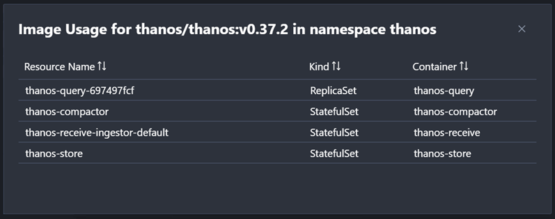
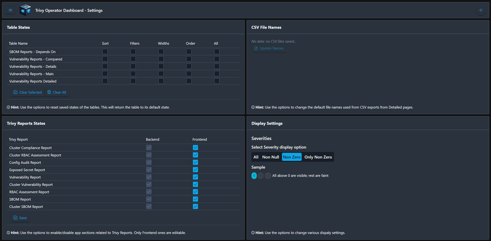

# Trivy Operator Documentation

## Trivy Reports

All Trivy Reports can be seen in three ways, Overview mode (in Home), 
Inspect mode (Browse) and Detailed. All of them are explained as follows.

> **Note:** All examples in this documentation are from Vulnerability Reports pages, as all Trivy Reports related pages are similar as layout and functionalities

### Overview mode

It is the "at a glance" page, where various statistics related to Trivy Reports can be seen.

On the left are some tables related to various statistics **(1)**, and on the right (where applicable) are some graph **(2)** to give an idea how they stand.

 *Main Overview page*

Also, some other info can be seen here, by pressing the **More** buttons **(3)**.

 *More on Severities*

The **Distinct values** **(4)** is grouping same values in order to have an real feeling related to the reports; i.e. in Vulnerability Reports Statistics, the severities are shown as distinct (unique) ones, which means that if the same Vulnerability is found in many containers, it will be counted as one.

### Inspect mode (Browse)

It is the page where Reports are grouped in order to simplify their inspection. The layout is a classic master **(1)** - details **(2)** one.

In Vulnerability Reports case, the master table **(1)** contains the images and the detail table **(2)** the related vulnerabilities. In order to avoid duplicates, all images that are the same are grouped, and their usage by Replicasets, Statefulsets, Jobs etc. can be seen by accessing **(7)**.

 *Inspect (browse) page*

In all tables you can find various action buttons **(3)**, most of the columns can be filtered and sorted **(4)**. Depending on the case, some tables support row expansion **(5)**, if more info can be displayed **(6)**, **(7)**. And, of course, footer **(8)**

 *Image usage in namespace*

If **(9)** is a Split Button, then the popup can be used to filter the data directly from the server. This can be useful, as an example, if you are a dev and want to see only severities that are Critical, High and Medium from a specific namespace.

 *Server side filter*

### Detailed

In this mode, all data is denormalized in a single large table, with all info from Reports. Filtering, sorting and CSV export are available.

 *Details page*

## Others

### Watcher States

The backend uses kubernetes Watchers to get the changes in realtime. Their states (running, errors) can be seen here with remediation solutions.

 *Watcher States*

> **Note:** If any watcher is in an error state, an alert will be triggered, and a Notification Bell appears in the top menu bar.

### Settings

It consists in three main sections:
- Table States - all tables from the app persist their states (column order and size, sorts, filters etc.). Here you can clear per need the saved state.
- CSV File Names - all file names used for exports to CSV are persisted. If you wish to change their defaults, here it is the place to do it
- Trivy Reports States - here sections related to a Trivy Report can be (in)activated in the frontend (i.e. there is no need to use Config Audit Reports). Also, if inactivated in the backend, it will be shown here.

